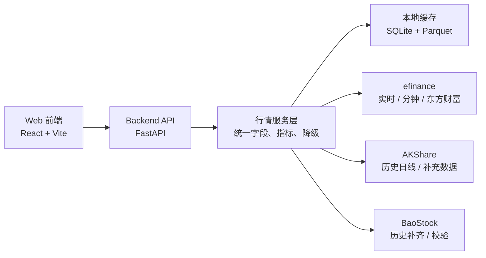

# A 股走势分析工具总体实现方案

## 目标

做一个本地优先、启动快、可逐步扩展的 A 股走势分析工具。第一版聚焦个人使用场景：

- 搜索股票并查看日 K、分钟 K。
- 展示 MA、MACD、RSI、成交量。
- 展示实时行情、涨跌幅、换手率、成交额、资金流。
- 管理自选股并形成看板。
- 本地缓存常用数据，减少重复请求并降低数据源波动影响。

## 总体架构

## 分层设计

### 1. 前端层

职责：

- 自选股看板：首页展示实时价格、涨跌幅、成交额、资金流摘要。
- 行情详情页：K 线、成交量、指标副图、区间切换。
- 搜索与收藏：支持代码、名称、拼音首字母的基础搜索。
- 设置页：缓存目录、刷新频率、默认周期、指标参数。

建议组件：

- `WatchlistBoard`：自选股表格。
- `StockSearch`：股票搜索。
- `KlineChart`：K 线主图。
- `IndicatorPanel`：MACD / RSI / 成交量副图。
- `CapitalFlowPanel`：资金流视图。

### 2. API 层

职责：

- 对前端提供稳定 JSON 接口。
- 屏蔽不同数据源字段差异。
- 控制缓存读取、刷新、过期策略。
- 返回数据质量信息，例如来源、更新时间、是否来自缓存。

推荐使用 FastAPI，因为它对类型标注、自动 OpenAPI 文档和本地开发都很友好。

### 3. 服务层

职责：

- `QuoteService`：实时行情。
- `KlineService`：日线、分钟线。
- `IndicatorService`：MA、MACD、RSI 等指标计算。
- `MoneyFlowService`：资金流数据。
- `WatchlistService`：自选股管理。
- `ProviderRouter`：按数据类型选择 efinance、AKShare、BaoStock，并处理失败降级。

### 4. 数据源适配层

每个数据源只在自己的 adapter 内出现，禁止前端或业务服务直接依赖第三方库字段。

建议 adapter：

- `EFinanceAdapter`
- `AKShareAdapter`
- `BaoStockAdapter`

统一输出字段示例：

| 字段 | 类型 | 含义 |
| --- | --- | --- |
| symbol | string | 股票代码，如 `600519` |
| market | string | `SH` / `SZ` / `BJ` |
| name | string | 股票名称 |
| trade_time | datetime | 行情时间 |
| open | number | 开盘价 |
| high | number | 最高价 |
| low | number | 最低价 |
| close | number | 收盘价 / 最新价 |
| volume | number | 成交量 |
| amount | number | 成交额 |
| turnover | number | 换手率 |
| pct_chg | number | 涨跌幅 |
| source | string | 数据来源 |

## 技术选型

| 模块 | 方案 | 原因 |
| --- | --- | --- |
| 后端 API | FastAPI | 类型友好、接口文档自动生成、适合本地工具 |
| 数据处理 | pandas / numpy | AKShare 和 efinance 原生返回 DataFrame，处理成本低 |
| 本地缓存 | SQLite + Parquet | SQLite 管元数据，Parquet 管时序数据，便于增量和离线分析 |
| 后台任务 | APScheduler | 简单定时刷新自选股和日线 |
| 前端 | React + Vite | 启动快，生态成熟 |
| K 线图 | lightweight-charts | K 线体验好，适合金融时序 |
| 图表补充 | ECharts | 资金流、行业、排行图表实现快 |

## 第一版边界

第一版只做个人本地工具，不做用户系统、不做云端同步、不做交易下单、不做荐股和自动买卖。

优先保障：

- 数据获取稳定。
- 缓存可复用。
- 前端图表可读。
- 数据源失败时有明确提示和缓存兜底。

